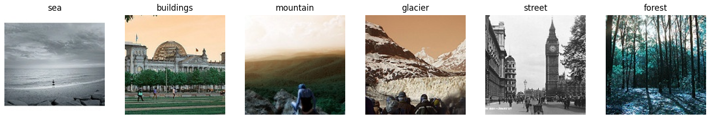

# Classification
I implement a simple image classification task on custom dataset, with code for both keras and pytorch.

# Data preparation: 

Because the size of the whole dataset is big, so in this project, i only create a sample of few images for demo.
You can get the whole dataset from this link:
https://www.kaggle.com/puneet6060/intel-image-classification

After downloading the dataset from above links, please arange the images as the same as folder "data" in this project.
There are 3 subfolders "train", "test", "val", each folder contains 6 subfolders that contains images from 6 classes.

# Data visualization 

# Installation:

For training this project, i use following environment:

- tensorflow==1.15.0

- keras==2.3.1

- torch==1.3.1

# Train and test: 

1. With keras model:
- To train:

Simply run the file "train.py" inside the folder "keras_model".

After training completed, the trained model will be saved inside the folder "keras_model/checkpoint" and the history plot will be saved in folder "keras_model/logs".
For example, if there are already two folders "keras_model/checkpoint/1" and "keras_model/logs/1" before training, then after training model, the program will create two new folders "keras_model/checkpoint/2" and "keras_model/logs/2" and finally, new weights and logs will be saved into these two folders. 

To visualize the training history, please use tensorboard, for example running the command "tensorboard --logdir keras_models/logs/1" inside terminal. 

- To test:

At the end of the file "keras_model/train.py", please comment the code for training and then uncomment the code for function test(). You can also pass another weight path inside the function test() if you want to load another weight model. 

2. With pytorch model:

- To train:

Simply run the file "train.py" inside the folder "pytorch_model".
Then,the trained model will be saved inside the folder "pytorch_model/checkpoint" and the history plot will be saved in folder "pytorch/logs".
For example, if there are already two folders "pytorch_model/checkpoint/1" and "pytorch_model/logs/1" before training, then after training model, the program will create two new folders "pytorch_model/checkpoint/2" and "pytorch_model/logs/2" and finally, new weights and logs will be saved into these two folders.

- To test: 

At the end of the file "pytorch_model/train.py", please comment the code for training and then uncomment the code for function test(). You can also pass another weight path inside the function test() if you want to load another weight model. 

